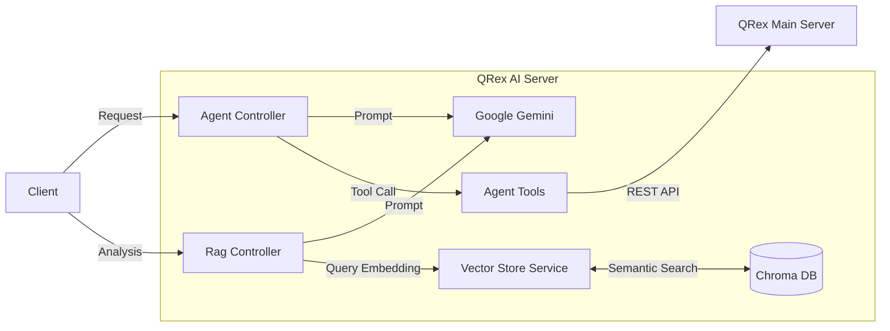

# 🎓 QRex RAG Server: AI-Based Phishing Detection System

## 📖 1. 프로젝트 개요 (Overview)

**QRex RAG Server**는 지능화되는 QR싱(Qhishing) 및 URL 피싱 위협에 대응하기 위해 설계된 **AI 전용 백엔드 서버**입니다.
기존의 단순 규칙 기반 차단을 넘어, **LLM(Large Language Model)** 의 추론 능력과 **RAG(Retrieval-Augmented Generation)** 기술을 결합하여 알려지지 않은 위협(Zero-day)까지 탐지하는 것을 목표로 합니다.

특히, **Chroma DB(Vector Database)** 를 도입하여 방대한 보안 지식 데이터를 벡터화하고, 의미 기반의 고성능 검색(Semantic Search)을 구현했습니다.

---

## 💡 2. 핵심 기술 및 구현 알고리즘 (Technical Highlights)

### 2.1 벡터 데이터베이스 기반 RAG 아키텍처
기존의 단순 텍스트 매칭 방식의 한계를 극복하기 위해 **Vector Store(Chroma DB)** 를 구축했습니다.
- **임베딩(Embedding):** 보안 가이드와 피싱 사례 데이터를 고차원 벡터로 변환하여 저장합니다.
- **의미 기반 검색(Semantic Search):** 사용자가 "폰이 이상해요"라고 입력해도 "해킹 의심 증상"이나 "긴급 대응 수칙"과 같은 연관 문서를 정확히 찾아내어 답변 정확도를 비약적으로 높였습니다.

### 2.2 하이브리드 피싱 탐지 (Hybrid Analysis)
**속도**와 **정확도**를 모두 확보하기 위한 2단계 필터링 파이프라인을 설계했습니다.
1.  **Fast Path (Rule-Based):** 화이트리스트/블랙리스트를 통한 0.1초 이내 즉각 차단/허용.
2.  **Deep Path (AI Reasoning):** 판단이 모호한 URL은 Gemini 2.5 모델과 RAG를 통해 URL 구조, 타이포스쿼팅, IP 직접 접속 여부 등을 심층 분석합니다.

### 2.3 AI Agent & Function Calling
단순한 챗봇이 아닌, 실제 시스템을 제어하는 **행동하는 에이전트(Agent)**를 구현했습니다.
- AI가 사용자의 자연어(예: "방금 쓴 글 지워줘")를 이해하고, 스스로 판단하여 `deletePostById`와 같은 **Java 함수(Method)** 를 실행합니다.

---

## 🛠 3. 기술 스택 (Tech Stack)

| 구분 | 기술 (Version) | 선정 이유 |
| :--- | :--- | :--- |
| **Language** | **Java 21** | 최신 LTS 버전의 안정성 및 고성능 IO 처리 |
| **Framework** | **Spring Boot 3.3.5** | 엔터프라이즈급 애플리케이션 구축 및 의존성 관리 |
| **AI Core** | **Spring AI (1.1.0-M4)** | LLM 및 Vector Store 추상화 인터페이스 제공 |
| **Vector DB** | **Chroma DB** | 오픈소스 벡터 데이터베이스, 빠른 검색 속도 및 로컬/도커 운용 용이성 |
| **LLM Model** | **Google Gemini** | `1.5-flash-lite`(Agent), `2.5-flash`(Deep Analysis) 이원화 운영 |
| **Build Tool** | Gradle | 유연한 빌드 스크립트 및 멀티 모듈 관리 |

---

## 📂 4. 시스템 구조 (Architecture)

---

## 🔌 5. 주요 API 명세 및 로직 (API Specifications & Logic)

단순한 입출력이 아닌, **RAG(검색 증강 생성) 파이프라인의 내부 동작 과정**입니다.

### 🛡️ 1. 피싱 위험도 정밀 분석 (Phishing Risk Analysis)
`GET /api/rag`

외부 위협 정보를 실시간으로 분석하여 URL의 안전성을 검증합니다.

- **Input Parameters:**
  - `question` (String): 분석 대상 URL
  - `ip_location` (String): 클라이언트 IP 위치 정보
- **Internal Logic (Pipeline):**
  1.  **Rule Check:** 블랙리스트/화이트리스트 메모리 캐시 조회 (0.01ms)
  2.  **Vector Search:** 입력 URL 및 관련 키워드를 **임베딩(Embedding)** 하여 **Chroma DB**에서 유사한 최신 피싱 사례/보안 가이드 검색
  3.  **LLM Reasoning:** 검색된 Context(지식)와 URL 구조 정보를 결합하여 Gemini Pro 모델에 전송
- **Output:**
  - Risk Level (`SAFE`, `DANGEROUS`, `SUSPICIOUS`)
  - JSON 포맷의 상세 분석 리포트

### 🤖 2. AI 에이전트 대화 (AI Agent Chat)
`GET /api/agent/chat`

사용자와의 자연어 대화를 통해 의도를 파악하고 적절한 도구를 실행합니다.

- **Input Parameters:**
  - `message` (String): 사용자 발화
  - `isLoggedIn` (Boolean): 권한 확인용 플래그
- **Internal Logic (Pipeline):**
  1.  **Intent Classification:** 사용자의 발화가 단순 질문인지, 행동(Action) 요청인지 파악
  2.  **Context Retrieval:** 단순 질문일 경우 **Chroma DB** 에서 '서비스 이용 가이드' 벡터 검색 (Static RAG)
  3.  **Function Calling:** 행동 요청일 경우(예: "글 삭제해줘"), `deletePostById` 등 Java 메소드 매핑 및 실행
- **Output:**
  - AI의 답변 (Function 실행 결과가 포함된 자연어)
